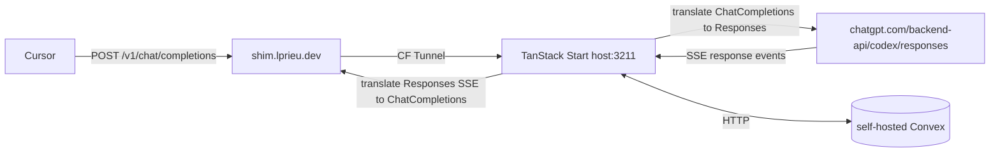

Shim est nomme d'apres le terme technique : un _software shim_ est une petite couche qui intercepte des appels API et reecrit les arguments ou redirige l'operation, ce qui est litteralement la definition du projet (intercepter `/v1/chat/completions` de Cursor, reecrire en Responses API, rediriger vers `chatgpt.com/backend-api/codex/responses`). Sibling de cctc (Claude), port 3211, subdomain `shim.lprieu.dev`. Single-user, laptop du dev, tunnel Cloudflare obligatoire.

## 1. Architecture

## 2. Stack technique

- Runtime Node 22 + Vite+ (skill `vite-plus-best-practices`) comme toolchain unifie (Oxlint, Oxfmt, vitest, build, task cache)
- TanStack Start (Vinxi/Nitro) avec `createAPIFileRoute` pour /api/v1/\* et `createServerFn` pour le dashboard
- TanStack Router (natif via Start), TanStack Query pour le polling analytics
- Zustand seulement si plusieurs composants partagent un etat non-server (sinon useState)
- Self-hosted Convex en Docker, port 3210 loopback
- Tailwind v4, shadcn-style (base UI), Sonner
- Zod pour les validators
- Streaming Web Streams API natif Nitro
- Cloudflare Tunnel vers `host.docker.internal:3211`
- IP whitelist memes IPs Cursor que cctc (52.44.113.131, 184.73.225.134)

## 3. Constantes Codex OAuth

Verbatim depuis [openai/codex server.rs](https://github.com/openai/codex/blob/9a8730f3/codex-rs/login/src/server.rs) :

- `CODEX_CLIENT_ID = "app_EMoamEEZ73f0CkXaXp7hrann"` (client_id public du Codex CLI)
- `CODEX_ISSUER = "https://auth.openai.com"`
- `CODEX_AUTHORIZE_URL = CODEX_ISSUER + "/oauth/authorize"`
- `CODEX_TOKEN_URL = CODEX_ISSUER + "/oauth/token"`
- `CODEX_REDIRECT_PORT = 1455` (hardcode cote OpenAI, pas le choix)
- `CODEX_REDIRECT_URI = "http://localhost:1455/auth/callback"`
- `CODEX_SCOPES = "openid profile email offline_access"`
- `CODEX_JWT_AUTH_CLAIM = "https://api.openai.com/auth"` (chemin du chatgpt_account_id dans le JWT id_token)
- `CODEX_BASE_URL = "https://chatgpt.com/backend-api/codex"`
- `CODEX_USER_AGENT = "codex_cli_rs/0.101.0 (Mac OS 26.0.1; arm64) Apple_Terminal/464"`
- `CODEX_ORIGINATOR = "codex_cli_rs"`

Params OAuth additionnels obligatoires sur l'authorize URL : `id_token_add_organizations=true`, `codex_cli_simplified_flow=true`, `originator=codex_cli_rs`.

## 4. Endpoints exposes

Toutes les routes protegees par `ipWhitelistGuard()` middleware.

Cursor-facing :

- `POST /api/v1/chat/completions` (unique endpoint Cursor BYOK)
- `GET /api/v1/models` (Cursor ping ce endpoint au Verify)

Dashboard :

- `POST /api/auth/login` (demarre le flow, lance le listener 1455, renvoie l'authorize URL)
- `POST /api/auth/callback` (fallback paste-the-URL si port 1455 occupe)
- `GET /api/auth/status` (renvoie authenticated, expiresAt, accountId, planType)
- `GET /api/health`, `/api/analytics/`\*, `/api/rate-limit`

Rewrite Nitro de `/v1/`_ vers `/api/v1/_` (equivalent du next.config.ts rewrite de cctc).

## 5. Schema Convex

Tables : `oauthTokens`, `pkceState`, `requests`, `planUsageSnapshot`, `counters`.

Differences vs cctc :

- `oauthTokens` ajoute `idToken`, `accountId`, `planType` (extraits du JWT)
- Pas de `modelSettings` au depart (un seul modele : gpt-5.4)
- `requests` log `model`, `total_tokens`, `cached_tokens`, `prompt_cache_key`
- `planUsageSnapshot` vient de `/backend-api/codex/usage` cote [client.rs](https://github.com/openai/codex/blob/main/codex-rs/backend-client/src/client.rs)

## 6. Le coeur : proxy /api/v1/chat/completions

Reference d'implementation cote prod : [CLIProxyAPI codex_executor.go](https://github.com/router-for-me/CLIProxyAPI/blob/96f55570/internal/runtime/executor/codex_executor.go) lignes 645-685.

### 6.1 Headers obligatoires sur la requete sortante

- `Authorization: Bearer <accessToken>`
- `Chatgpt-Account-Id: <accountId>` extrait du JWT, OBLIGATOIRE
- `Originator: codex_cli_rs`
- `Version: 0.101.0`
- `Session_id: <uuid>` reutiliser pour activer prompt cache
- `Conversation_id: <uuid>` idem
- `User-Agent: codex_cli_rs/0.101.0 (Mac OS 26.0.1; arm64) Apple_Terminal/464`
- `Accept: text/event-stream`
- `Content-Type: application/json`
- `Connection: Keep-Alive`

### 6.2 Body Responses API

- `model = "gpt-5.4"` avec un point, pas un tiret. **Confirme Phase 0** : l'upstream rejette `gpt-4o-mini` avec `400 {"detail":"The 'gpt-4o-mini' model is not supported when using Codex with a ChatGPT account."}` (cf `captures/upstream-raw-attempt.txt`)
- `instructions = <string non-empty>` system prompt. **Confirme Phase 0** : un body sans `instructions` est rejete avec `400 {"detail":"Instructions are required"}` (cf `captures/upstream-raw-attempt-shape.txt`)
- `input = [...]` messages au format Responses
- `tools = [...]`
- `stream = true` OBLIGATOIRE
- `store = false` OBLIGATOIRE
- `prompt_cache_key = <sessionUuid>` egal au Session_id header

### 6.3 Token refresh coalesce

Pattern a copier verbatim de [cctc lib/server/oauth.ts](lib/server/oauth.ts) lignes 16-22 et 151-232. Trois couches : cache process, Convex, upstream refresh. La cle est un `refreshInFlight` Promise pour empecher deux refresh concurrents (les refresh_token rotent, sinon race conditions).

## 7. Traduction Chat Completions vers Responses API

C'est la partie qui n'existe pas dans cctc. A implementer dans `app/lib/server/translation/`.

### 7.1 Aller : ChatCompletionRequest vers ResponsesRequest

- `messages[]` (roles system/user/assistant/tool) vers `instructions` (concat des system) et `input[]` items
- `tools[]` (function-calling OpenAI) vers `tools[]` Responses (type function)
- `tool_calls` dans assistant vers items type `function_call`
- message tool vers item type `function_call_output`
- `temperature`, `top_p`, `max_tokens` mapped 1-1 (max_output_tokens cote Responses)
- supprimer `previous_response_id`, `prompt_cache_retention`, `safety_identifier` du body

### 7.2 Retour SSE : events response.\* vers chat.completion.chunk

Le SSE Codex emet `response.created`, `response.output_text.delta`, `response.output_item.added` (tool calls), `response.completed`. On les traduit en chat.completion.chunk (delta content et tool_calls[]).

Reference : sdktranslator dans CLIProxyAPI le fait en Go, transposable en TS. Ou utiliser le SDK officiel openai Node qui sait parser Responses streams.

### 7.3 Resultats Phase 0 et leur impact sur la traduction

Phase 0 (tests 1-2 ci-dessous, voir `docs/PHASE-0-RECON.md`) a revele deux choses critiques :

**1. Le payload Cursor BYOK est inaccessible cote client**

Cursor BYOK n'est PAS un thin wrapper client-side. Le client Cursor envoie le message utilisateur en gRPC a `api2.cursor.sh`, et le backend Cursor appelle OpenAI server-side avec la cle utilisateur. Sur 3238 flows captures via mitmproxy : 2163 vers `api2.cursor.sh`, **0 POST vers `/v1/chat/completions`** depuis Cursor. Le body Chat Completions n'est jamais assemble sur la machine de l'utilisateur.

Consequence : la fixture `cursor-byok.json` est forgee depuis la spec OpenAI Chat Completions, pas capturee. Acceptable car la spec est publique et stable. Si on veut un body Cursor authentique plus tard, deux options : pointer Cursor Base URL vers le shim deploye, ou reverse-engineer le gRPC `api2.cursor.sh`.

**2. L'upstream Codex Responses a deux gates independantes**

Tests Phase 0 Step 4 sur `/backend-api/codex/responses` :

- **Gate 1 - model allowlist** : un body avec `model: "gpt-4o-mini"` est rejete `400 {"detail":"The 'gpt-4o-mini' model is not supported when using Codex with a ChatGPT account."}`. Le `model` est valide AVANT la shape. Allowlist confirmee : `gpt-5.4` accepte (Step 2). Les autres modeles Codex restent a confirmer (probablement `gpt-5-codex`, `o3`, etc.).
- **Gate 2 - body shape** : meme body en swapant `model: "gpt-5.4"`, rejete `400 {"detail":"Instructions are required"}`. Le upstream attend `instructions` (string, system role) + `input` (array), pas `messages`.

Consequence : le translator Phase 5 doit faire DEUX traductions independantes : (a) mapping de nom de modele (Chat Completions models vers Codex allowlist), (b) restructuration body (`messages[]` vers `instructions` + `input[]`). Le mapping de modele se fait avant la traduction de body.

**3. Plan d'execution Phases 3-5**

Avec ces contraintes connues, l'ordre incremental devient :

1. Translation minimale : 1 user message, 1 system message, pas de tools, pas de streaming. Verifier roundtrip `response.completed` sur upstream avec body traduit.
2. Streaming : activer `stream: true`, parser events SSE en temps reel, traduire vers `chat.completion.chunk`.
3. Tools : function-calling (Cursor Agent mode en utilise massivement).

Fixtures disponibles pour les tests d'integration :

- `captures/cursor-byok.json` (one-shot user message, body forge spec-conforme)
- `captures/cursor-byok-tools.json` (tool-use complet : tools[], tool_calls, role:tool)
- `captures/upstream-response.sse` (vrai stream SSE Responses, gpt-5.4)
- `captures/test-request.json` (body Responses minimal valide, reference pour le translator)

## 8. Flow OAuth (option both validee)

Redirect URI hardcode cote OpenAI = `http://localhost:1455/auth/callback`. Pas le choix.

### 8.1 Listener ephemere (chemin principal)

Pendant le clic Authorize :

1. server function `startLogin()` genere PKCE (code_verifier 48 bytes random, code_challenge SHA-256 base64url), genere state UUID, insere dans Convex pkceState, lance un `http.createServer()` Node sur 127.0.0.1:1455 dans la closure (Nitro = acces direct a node:http) avec timeout 5 min. Handler /auth/callback verifie state, extrait code, resolve la Promise exposee a l'UI via SSE/polling, repond une page de confirmation HTML
2. UI ouvre l'authorize URL dans un nouveau tab via `window.open()`
3. Le navigateur de l'utilisateur (meme machine) atterrit sur localhost:1455/auth/callback?code=...&state=... et le listener capture
4. `exchangeCode()` POST `oauth/token` en form-urlencoded (pas JSON, difference majeure vs Anthropic), persiste tokens, extrait chatgpt_account_id du id_token

### 8.2 Fallback paste-the-URL

Si EADDRINUSE sur port 1455 (Codex CLI deja lance, ou autre login en cours) : l'UI affiche un champ Paste the redirect URL here, l'utilisateur copie l'URL depuis sa barre d'adresse (la page d'erreur ERR_CONNECTION_REFUSED du navigateur expose toujours l'URL complete), POST /api/auth/callback avec {redirectUrl} qui parse code et state.

Pattern identique a [free-code/codex-client.ts](https://raw.githubusercontent.com/paoloanzn/free-code/main/src/services/oauth/codex-client.ts).

### 8.3 Subtilite Docker

Le port 1455 doit etre accessible depuis le navigateur de l'utilisateur, donc sur la machine hote, pas dans un container. TanStack Start tourne en mode dev sur l'hote (identique au pattern cctc qui garde pnpm dev foreground). Si containerise plus tard pour la prod, il faudra bind-mount le port 1455.

## 9. Differences vs cctc

- Stack web : Next.js 16 vers Vite+ + TanStack Start
- OAuth client_id : Claude Code CLI vers Codex CLI (app_EMoamEEZ73f0CkXaXp7hrann)
- Token endpoint body : JSON vers form-urlencoded
- Redirect URI : Anthropic affiche le code vers listener localhost:1455
- Account ID : aucun vers chatgpt_account_id (header Chatgpt-Account-Id)
- System prompt magique : "You are Claude Code..." verbatim vers aucun
- Beta headers : anthropic-beta vers Originator/Version/Session_id
- Tool prefix : mcp\_ vers aucun
- Stop sequences turn-marker : oui vers aucun
- Cache breakpoints : manuels (cache_control ephemeral) vers automatique via prompt_cache_key
- Format API upstream : Anthropic Messages vers OpenAI Responses
- Format API Cursor BYOK : Anthropic+OpenAI translate vers OpenAI /v1/chat/completions uniquement
- Traduction interne : OpenAI vers Anthropic optionnel vers Chat Completions vers Responses OBLIGATOIRE
- IP whitelist Cursor : identique
- Convex schema : 6 tables vers 5-6 tables
- Refresh coalescing : pattern identique a copier

## 10. Plan d'execution par phases

- Phase 0 (Recon et validation) **[DONE]** : tests 1-2 de section 7.3, capturer un payload Cursor avec mitmproxy (PIVOT : fixtures forges depuis la spec OpenAI car BYOK Cursor est server-side), valider l'endpoint upstream avec un access_token obtenu manuellement via le CLI Codex officiel. Findings dans `§7.3` ci-dessus + `docs/PHASE-0-RECON.md`. Artefacts : `captures/upstream-response.sse`, `captures/cursor-byok.json`, `captures/cursor-byok-tools.json`, `captures/upstream-raw-attempt{,-shape}.txt`
- Phase 1 (Bootstrap) : `vp create @tanstack/start`, ajouter Tailwind v4 + shadcn init, Convex CLI init, docker-compose (reutiliser celui de cctc), Cloudflare tunnel pour shim.lprieu.dev vers host.docker.internal:3211
- Phase 2 (OAuth) : constantes section 3, PKCE helpers, listener 1455 + fallback paste, persist Convex, refresh coalesce. Critere de succes : GET /api/auth/status retourne authenticated, accountId, planType
- Phase 3 (Proxy minimal) : /api/v1/chat/completions handler, traduction request minimale, traduction response non-streaming, test curl
- Phase 4 (Streaming SSE) : Web Stream Nitro, parser SSE Responses, traduire en temps reel vers chat.completion.chunk, gerer [DONE]
- Phase 5 (Tools + Cursor) : function-calling translation, branchement Cursor BYOK, debug Agent mode
- Phase 6 (Dashboard) : auth flow UI, status badge, analytics, plan usage via /backend-api/codex/usage, logs requests
- Phase 7 (Durcissement) : IP whitelist, rate-limit cache, gestion 401 (clear cache), gestion 429 (parse error.resets_at), logger structure

## 11. Ressources cles

- [openai/codex server.rs](https://github.com/openai/codex/blob/9a8730f3/codex-rs/login/src/server.rs) flow OAuth officiel (PKCE, exchange, refresh, JWT parsing)
- [openai/codex backend-client/client.rs](https://github.com/openai/codex/blob/main/codex-rs/backend-client/src/client.rs) headers et endpoints upstream
- [CLIProxyAPI codex_executor.go](https://github.com/router-for-me/CLIProxyAPI/blob/96f55570/internal/runtime/executor/codex_executor.go) proxy en prod (Go, transposable en TS)
- [free-code/codex-client.ts](https://raw.githubusercontent.com/paoloanzn/free-code/main/src/services/oauth/codex-client.ts) implementation TS de reference (PKCE + listener 1455)
- [oc-chatgpt-multi-auth](https://github.com/ndycode/oc-chatgpt-multi-auth) plugin opencode equivalent
- Code source actuel a copier : [lib/server/oauth.ts](lib/server/oauth.ts), [lib/server/anthropic-client.ts](lib/server/anthropic-client.ts), [convex/schema.ts](convex/schema.ts), patterns refresh coalesce, IP whitelist, semaphore upstream, rate-limit cache

## 12. Risques connus

- OpenAI peut bloquer ce pattern a tout moment : Anthropic l'a fait en fevrier 2026, Google idem pour Gemini CLI. Le client_id Codex est public et Originator est une simple string. Pas de garantie de longevite.
- Endpoint chatgpt.com/backend-api/codex/responses susceptible de changer (deja arrive : l'ancien /backend-api/responses supprime fin 2025).
- Traduction Chat Completions et Responses imparfaite : certains champs Cursor (ex. prediction, parallel_tool_calls) n'ont pas d'equivalent direct cote Responses, choisir une politique (drop / 400) au cas par cas.
- **Model allowlist Codex stricte** : l'upstream rejette en 400 tout modele hors allowlist Codex (confirme Phase 0 sur `gpt-4o-mini`). Le mapping de modele est obligatoire et la liste exacte des modeles acceptes reste a etablir (`gpt-5.4` confirme ; `gpt-5-codex`, `o3` a verifier). Si Cursor envoie un modele inconnu, le shim doit fallback sur un default acceptable plutot que de propager le 400 amont.
- **Cursor BYOK est server-side, pas client-side** (confirme Phase 0) : aucune visibilite locale sur le body Cursor envoie a OpenAI. Si Cursor ajoute des champs proprietaires non-Chat-Completions au body, on ne les saura qu'en pointant Cursor sur le shim deploye et en logguant les bodies recus. Pas un blocker, juste une zone d'incertitude residuelle pour Phase 5.
- CGU OpenAI : usage personnel uniquement, jamais commercial (comme cctc).
- Le terme `shim` est generique (existe dans pleins de stacks Windows/Linux/Node), donc moins distinctif niveau branding pur, mais c'est sans impact pour un tool personnel non-commercial.

## 13. Prochaine action

Phase 0 **DONE** (cf §7.3 findings + `docs/PHASE-0-RECON.md`). Repo cree, plan copie dans BLUEPRINT.md, upstream valide, fixtures forges, contraintes upstream documentees.

**Prochaine action : Phase 1 - Bootstrap**

1. `vp create @tanstack/start` (skill `vite-plus-best-practices`)
2. Tailwind v4 + shadcn init
3. Convex CLI init
4. docker-compose (reutiliser celui de cctc)
5. Cloudflare tunnel pour `shim.lprieu.dev` vers `host.docker.internal:3211`

Critere de succes Phase 1 : `pnpm dev` (ou equivalent `vp dev`) sert un placeholder a `https://shim.lprieu.dev`, Convex accessible en local sur 3210.
