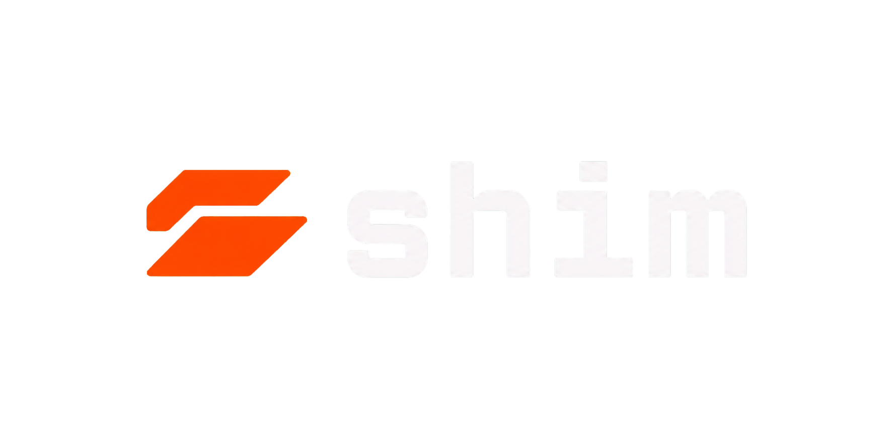

<p align="center">
  
</p>

<p align="center">
  Cursor BYOK proxy for routing OpenAI-compatible chat completions through a Codex-backed session.
</p>

<p align="center">
  
  
  
  
  
</p>

<p align="center">
  <a href="#features">Features</a> ·
  <a href="#quick-start">Quick start</a> ·
  <a href="#cursor-byok-setup">Cursor BYOK setup</a> ·
  <a href="#development">Development</a>
</p>

## Features

- OpenAI-compatible `/v1/chat/completions` endpoint for Cursor BYOK.
- Codex/OAuth session flow with server-side token handling.
- Dashboard for onboarding, model selection, settings, health, and plan usage.
- Convex-backed persistence for OAuth state, settings, usage snapshots, counters, and request metadata.
- Cloudflare Tunnel-oriented setup for exposing only the proxy route publicly.
- Tailwind CSS v4 UI using local design tokens and shadcn-style primitives.

> [!IMPORTANT]
> Cursor BYOK rejects private network URLs. Use a public tunnel URL for Cursor, and keep the dashboard local unless you intentionally expose it.

## Stack

- React 19 + TanStack Start / TanStack Router
- Vite+ (`vp`) with React, Nitro, Tailwind CSS v4, and TanStack Devtools plugins
- Convex self-hosted backend and dashboard via Docker Compose
- TypeScript strict mode, Vitest/jsdom through Vite+
- Base UI, lucide-react, sonner, zod, class-variance-authority, and tailwind-merge

## Quick start

```bash
pnpm install --frozen-lockfile
cp .env.example .env
```

Fill `.env` with local Convex values and any tunnel settings you need.

```bash
docker compose up -d convex convex-dashboard
pnpm convex:deploy
pnpm dev
```

Open the app at `http://127.0.0.1:3221` and follow the onboarding flow.

> [!NOTE]
> `pnpm convex:deploy` runs `vpx convex dev --once`; despite the script name, it is the local Convex sync command used by this project.

## Environment

| Variable | Purpose |
| --- | --- |
| `CONVEX_INSTANCE_NAME` | Local Convex instance name. |
| `CONVEX_INSTANCE_SECRET` | Required before the Convex container starts. |
| `CONVEX_SELF_HOSTED_URL` | Server-side Convex URL, defaulting to `http://127.0.0.1:3220`. |
| `CONVEX_SELF_HOSTED_ADMIN_KEY` | Admin key printed by local Convex. |
| `VITE_CONVEX_URL` | Browser-side Convex URL. |
| `CLOUDFLARE_TUNNEL_TOKEN` | Required only when running the tunnel container profile. |
| `APP_PORT` | App port, default `3221`. |
| `CONVEX_PORT` | Convex backend port, default `3220`. |
| `CONVEX_SITE_PROXY_PORT` | Convex site proxy port, default `3222`. |
| `CONVEX_DASHBOARD_PORT` | Convex dashboard port, default `6792`. |
| `ALLOWED_IPS` | Comma-separated proxy IP allow-list, or `disabled` for local development. |

## Cursor BYOK setup

After onboarding records a public tunnel URL, use these values in Cursor:

```text
Base URL: https://your-public-tunnel.example/v1
Model name: codex
API key: any non-empty string
```

`codex` is a sentinel model name. The app replaces it server-side with the configured Codex model and reasoning effort.

To create a Cloudflare tunnel manually:

```bash
cloudflared tunnel create shim
cloudflared tunnel route dns shim shim.yourdomain.com
cloudflared tunnel run shim
```

The tunnel ingress should point to `http://localhost:3221` and the public route should be restricted to `^/v1/.*` when possible.

## Development

```bash
pnpm dev
pnpm test
pnpm build
pnpm preview
```

Useful checks:

```bash
pnpm exec vp --version
pnpm exec tsc --version
```

Project layout:

```text
convex/                 Convex schema, functions, and generated client bindings
public/                 Manifest and app logos
src/components/         React UI components
src/components/ui/      Reusable shadcn-style primitives
src/lib/                Shared client utilities
src/lib/server/         Server handlers, OAuth, translation, settings, and middleware
src/routes/             TanStack Router pages and API routes
vite.config.ts          Vite+ app, test, lint, format, and staged config
```

## Docker profiles

```bash
docker compose up -d convex convex-dashboard
docker compose --profile tunnel up -d cloudflared
docker compose --profile prod up -d app
```

- Default services run local Convex and the Convex dashboard.
- The `tunnel` profile runs Cloudflare Tunnel and requires `CLOUDFLARE_TUNNEL_TOKEN`.
- The `prod` profile builds and runs the app container behind the same local ports.

## API surface

- `POST /v1/chat/completions` and `POST /api/v1/chat/completions`: OpenAI-compatible chat completion proxy.
- `GET /v1/models`: model list endpoint.
- `GET /api/health`: app health endpoint.
- `GET/POST /api/settings`: dashboard settings.
- `GET /api/usage`: latest plan usage snapshot.
- `GET /api/auth/login`, `/api/auth/callback`, `/api/auth/status`, `/api/auth/logout`: Codex OAuth flow.

## Notes for agents

See [`AGENTS.md`](./AGENTS.md) for repository-specific coding rules, safety guardrails, and validation expectations.
